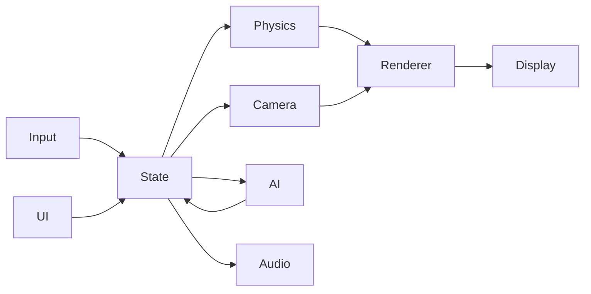
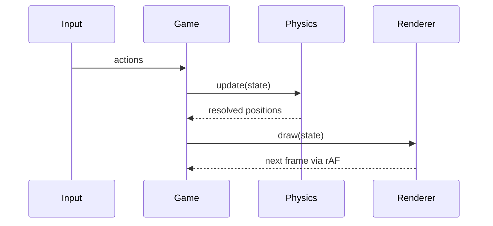

# Design

## SAD (System Architecture Design)
- Single-page application served by `index.html` that boots `main.js` and the HUD layer.
- Runtime modules are grouped into **input**, **physics**, **renderer**, **camera**, **AI/NPC**, **UI/HUD**, **audio**, and **PWA/i18n** subsystems.
- `requestAnimationFrame` drives an update → physics → render loop that targets 60 FPS.
- Game state is held in a central object created by `createGameState()` and shared across modules.
- Data flow: user input mutates state → physics resolves collisions → camera follows the player → renderer draws the visible slice.



## SDS (Software Design Specification)
### Game Loop and State
- `main.js` preloads textures and audio via `Promise.all`, constructs the initial game state using `createGameState()`, and registers input/HUD listeners. Once assets resolve it starts the loop with `requestAnimationFrame(tick)`.
- `tick(time)` calculates `dt = min(time - lastTime, 32)` to avoid spiral-of-death stalls, then executes the frame in a fixed order:
  1. apply pending input to mutate player velocity and state;
  2. decrement countdown timers and dispatch `countdown:warning` at 10 s and `countdown:end` at 0 s;
  3. spawn NPCs whose delay has expired;
  4. advance NPC AI state machines;
  5. resolve physics and collisions;
  6. update camera position;
  7. call `draw(state)` to render.
  After rendering, `tick` schedules the next frame with `requestAnimationFrame`.
- The shared `state` object exposes `{ player, npcs, camera, timer, level, coins, lights }`. Modules mutate only their own sub-objects to avoid unintended coupling.
  The preload step builds an `assets` map where each entry is either an `Image` or `Audio` element. `Promise.all` wraps `fetch` and `decodeAudioData` calls so that the loop begins only when every asset is ready. Input listeners push symbolic actions (`'left'`, `'jump'`, `'slide'`) into a queue. The queue is drained during step (1) of `tick`, ensuring deterministic order regardless of event timing. The central `state` object also keeps immutable constants like `LEVEL_W` and `LEVEL_H` so modules can compute bounds without importing extra files.
  Pseudocode for the main loop:
  ```js
  let last = 0;
  function tick(time){
    const dt = Math.min(time - last, 32);
    last = time;
    applyInput(dt);
    updateTimers(dt);
    spawnNpcs(dt);
    runNpcAI(dt);
    resolvePhysics(dt);
    updateCamera(dt);
    draw(state);
    requestAnimationFrame(tick);
  }
  ```

### Player and Physics
- Input maps to acceleration: holding left/right sets `ax` to ±0.004 px/ms² and updates facing. Velocity integrates as `vx += ax*dt` and `vy += gravity*dt` with gravity `0.0025 px/ms²`. Velocities clamp to ±0.35 px/ms horizontally and 1.5 px/ms vertically.
- Collision resolution uses a swept **AABB** algorithm. For each axis, the engine computes potential penetration depth, moves the entity to the contact edge, and zeroes the velocity component if a solid tile or NPC is hit.
- The player state machine includes `idle`, `run`, `jump`, `slide`, and `stunned`. Sliding halves the hitbox height and locks the state for 400 ms; releasing slide or encountering a red light transitions back to `run` and restores the hitbox.
  When idling on the ground, `updatePlayerWidth` keeps `player.w` at `COLL_W` (one tile) for physics but sets `player.renderW` to `BASE_W*2/3` so `drawPlayer` renders a narrower sprite while collisions remain unaffected.
  A friction coefficient of `0.0008` reduces horizontal velocity when no input is applied, producing gradual deceleration: `vx += -Math.sign(vx)*Math.min(Math.abs(vx), friction*dt)`. Jump initiation sets `vy = -0.75` and flags `onGround = false`. The swept AABB implementation calculates entry times `tx` and `ty` against tile boundaries:
  ```js
  const tx = (nextX - tileEdgeX) / vx;
  const ty = (nextY - tileEdgeY) / vy;
  const t = Math.max(tx, ty);
  if (t >= 0 && t <= 1) { /* collision */ }
  ```
  Ground detection simply checks `vy === 0` after resolving the vertical axis. Each entity stores `{ pos:{x,y}, vel:{x,y}, ax, ay, state, hitbox:{w,h} }` for physics calculations.
  Stomping an NPC sets `player.vy` to `JUMP_VEL` and invokes `triggerStompEffect` with the NPC's screen coordinates to draw a 24 px star for 300 ms at the impact point.

### NPC and Level Systems
- Each level maintains `nextSpawn` in milliseconds. When it reaches zero, the engine picks an NPC template (OL, Student, Officeman) using equal probabilities, spawns it at the right edge, and resets `nextSpawn` to a random 4–8 s interval. The default Character1 or a Trunk may appear instead with equal chance when a special NPC is not chosen; Trunk spawns from the left.
- NPCs follow a small state machine: `walk` → (`stomped` with upward bounce and incremented `hits`) → `recover`. After three stomps `hits >= 3`, the player passes through the NPC until it exits the screen. Side collisions push both entities apart and enter a `knockback` state for 300 ms.
- Officeman rendering multiplies the draw scale by `1.25` while Trunk uses `1.1`, both around the sprite center: `ctx.save(); ctx.translate(cx, cy); ctx.scale(extra,extra); ...; ctx.restore();` Collision boxes remain unscaled.
- Level geometry loads from `assets/objects.custom.js` (falling back to `objects.js`). Each object entry is `{ type, x, y, transparent?, collision?[] }`. `buildCollisions()` converts these into solid tile masks, and `spawnLights()` instantiates traffic lights with phases.
- NPC spawn height uses the player's `baseH` so that temporary slide height changes do not affect NPC size or ground alignment.
- NPC collision boxes use a fixed `TILE` width regardless of sprite dimensions to ensure consistent player interactions.
- NPCs are culled once their left edge reaches the camera's x position, and left-side spawns clamp their initial X to the first tile to avoid falling.
- Automatic spawns merge provided NPC options with an empty object before adding boundary flags so missing option objects do not throw errors.
- OL, Officeman, and Student NPCs include dedicated idle sprite sequences (`idle_000`–`idle_012` for OL and Student, `idle_000`–`idle_018` for Officeman) loaded at 6 FPS and played whenever a red light pauses them.
- Trunk NPCs load `Move_000`–`Move_012` frames as a `walk` animation at 8 FPS, draw two `TILE`s lower with a shadow one third their width offset one `TILE` upward, stand twice the player's `baseH`, scale 1.1× from their center, move right at speed 3, and mark `passThrough` and `ignoreRedLight` so the player cannot collide or stand on them and red lights never pause them; `passThrough` is reapplied every frame to keep trunks non-solid, and their movement triggers a slide-like dust effect roughly every 200 ms.
  NPC templates specify `{speed, sprites, width, height}` and are shallow-cloned for each spawn. The spawn routine places new NPCs at `(LEVEL_W + 24, groundY)` so they walk into view from the right. State transitions are driven by timers:
  ```js
  switch(npc.state){
    case 'walk': if (npc.hit) npc.state='stomped'; break;
    case 'stomped': if (npc.timer>200) npc.state='recover'; break;
    case 'recover': npc.state='walk'; break;
  }
  ```
  When `hits` reaches 3 the `solid` flag toggles off allowing the player to pass through. `buildCollisions()` tiles a boolean grid indexed by `(x + y*LEVEL_W)` to speed up collision lookups during physics resolution.

### Rendering and Camera
- `draw(state)` clears the canvas, calculates visible tile ranges from `camera.x`/`camera.y`, and skips any tile or entity whose bounding box falls outside the viewport rectangle. All sprite draws multiply coordinates by `devicePixelRatio` and disable image smoothing for pixel art fidelity.
- Background layers regenerate an off-screen canvas whenever `devicePixelRatio` or fullscreen status changes. The regenerated image uses the canvas's CSS height to render at native resolution and avoid stretching artifacts. Visual viewport resize events (such as mobile browser chrome collapsing) also invoke this rescale so CSS scale factors stay synchronized.
- Camera logic keeps the player at 60 % of the viewport width: `if (player.x > camera.x + 0.6*VIEW_W) camera.x = min(player.x - 0.6*VIEW_W, LEVEL_W - VIEW_W)`. Vertical movement remains locked to the level height.
  Rendering order is background → level tiles → other NPCs → player → Trunk NPCs → HUD so trunks never hide behind characters. Tile rendering iterates visible columns and rows:
  ```js
  for (let y=minY; y<maxY; y++)
    for (let x=minX; x<maxX; x++)
      drawTile(level[y][x]);
  ```
  Each entity draw call computes `screenX = (entity.x - camera.x)*dpr` and skips rendering when `screenX` is outside `[0, VIEW_W*dpr]`. This culling keeps the draw list small enough to maintain 60 FPS.
  When design mode is enabled, rendering additionally draws green collision box outlines around visible tiles, the player, and NPCs to assist with level editing.

### PWA and Internationalization
- The service worker uses a cache-first strategy. During `install` it opens a versioned cache like `demo-v${APP_VERSION}` and stores `index.html`, scripts, sprites, and audio. `activate` removes caches that do not match the current version. `fetch` serves cached responses when available and falls back to network.
- `manifest.json` supplies icons, names, and `display: standalone` so installing the PWA launches a borderless window.
- Language modules under `src/i18n/*.js` export dictionaries. `setLanguage(code)` swaps the active dictionary and queues a HUD update; on the next frame, text nodes read from the new dictionary ensuring instant translation without reload.
  The service worker listens for `message` events so `navigator.serviceWorker.controller.postMessage({type:'update'})` can trigger a manual refresh prompt. Cache keys include the version string, forcing `install` to fetch fresh assets after each release. Internationalization uses `data-i18n` attributes; `setLanguage` iterates `document.querySelectorAll('[data-i18n]')` and replaces `textContent` from the chosen dictionary. Dictionaries follow a flat `{ key: text }` structure for quick lookup, and changing languages sets `state.language` which tests read to verify translations.

### Splash and Title Styling
- A `#splash` overlay sits above the HUD on load. CSS animation `splash-fade` fades in the teal **HPC GAMES** logo against a black background, holds for roughly two seconds, then fades out. The overlay disables pointer events, scales the logo with `font-size: clamp(32px, 10vw, 64px)`, and on initialization removes itself immediately when the animation has already finished so the start page is always interactive.
- The start screen title `#start-page .title` uses bold white text with wide letter spacing, a drop shadow, and `font-size: clamp(32px, 12vw, 72px)` so it shrinks on narrow screens but never exceeds 72 px.

## ICD (Interface Control Document)
- **Game State API**: `createGameState()` ⇒ `{ level, coins, lights, player, camera, npcs, GOAL_X, LEVEL_W, LEVEL_H, spawnLights(), buildCollisions(), transparent, indestructible, patterns, selection }` (no `score` or `time`).
- **UI Actions**: start button calls `showHUD()` and restart buttons call `restartStage()`; no custom events are emitted.
- **Input Mapping**: keyboard arrows/space/Z map to move/jump/slide; touch buttons dispatch the same actions via custom events.
- **Service Worker**: `navigator.serviceWorker.register('sw.js')`; messages of type `update` prompt a reload.
- **Error Handling**: modules throw on missing assets; the main loop catches errors, logs to console, and pauses the game.

### Game State Structure
| Field | Type | Description |
| --- | --- | --- |
| `level` | Object | Stage layout and geometry. |
| `coins` | Array | Remaining coin coordinates. |
| `lights` | Array | Pedestrian signal objects. |
| `player` | Object | Player entity state. |
| `camera` | Object | Viewport position. |
| `npcs` | Array | Active NPC entities. |
| `GOAL_X` | Number | X coordinate of level goal. |
| `LEVEL_W`/`LEVEL_H` | Number | Level dimensions in tiles. |

### Module Interaction


## ERD (Entity Relationship Overview)
| Entity | Fields |
| --- | --- |
| **Entity** | `id`, `type`, `pos{x,y}`, `vel{x,y}`, `state`, `hitbox{w,h}` |
| **TrafficLight** | `id`, `phase`, `area` |
| **LevelObject** | `id`, `type`, `x`, `y`, `transparent?`, `collision[]` |

**Relationships**
- Entities interact with level objects through AABB collisions.
- Traffic lights broadcast their `phase` to nearby entities.

## API
| Name | Parameters | Returns | Description |
| --- | --- | --- | --- |
| `createGameState()` | — | Object | Initializes and returns the mutable game state. |
| `showHUD()` | — | void | Reveals HUD elements while keeping the debug panel hidden. |
| `scripts/update-version.mjs` | — | void | Emits `version.js` and `version.global.js` from `RELEASE_VERSION`/`BUILD_NUMBER`/`GIT_SHA` env vars (fallback `package.json`) and updates HTML/manifest query parameters. |

## ADR (Architecture Decision Record)
- Chosen **vanilla JS** for minimal dependencies; build tools (Babel, Jest) are used only for development.
- Adopted a **24 px** collision sub-grid to support half tiles and precise masks.
- Enabled PWA support so the demo can run offline and be installed on mobile devices.

## UX
- HUD offers a gear menu, info panel, countdown timer, and circular touch controls pinned to the screen corners on mobile. A debug panel appears only when developer mode is enabled for developers or testers. Developer mode also reveals an NPC panel with **NPC1**/**NPC2** buttons wired to a `spawnNpc(type)` hook to insert an OL from the right or a Trunk from the left for testing. These hooks scale width with `player.baseH / 44` so spawned sprites keep their normal proportions.
- Orientation guard pauses play in portrait mode and resumes on landscape.
- Fullscreen uses centered letterboxing with black bars and resizes on `fullscreenchange` to preserve the 16:9 aspect ratio; styles target both `#stage:fullscreen` and `#game-root:fullscreen #stage`.

## Design Specs (DS)
| ID | Description | Requirements | Tests |
| --- | --- | --- | --- |
| DS-1 | Orientation guard overlay prompting landscape orientation. | FR-042 | T-1 |
| DS-2 | Slide cancellation at red lights restores player height. | — | T-2 |
| DS-3 | Mobile landscape fit-height layout. | NFR-003 | T-3 |
| DS-4 | `showHUD` helper reveals HUD without debug panel. | FR-040 | T-4 |
| DS-5 | Start page defaults with visible start button and correct title. | FR-001, NFR-006 | T-5 |
| DS-6 | Responsive UI styling, clear/fail overlays, and timer pulse. | FR-011, FR-012, FR-040, FR-041, NFR-006 | T-6 |
| DS-7 | OL NPC walk sprites for frames 0–11. | — | T-7 |
| DS-8 | One-minute countdown timer that flashes in the final 10 seconds. | FR-010 | T-8 |
| DS-9 | Pedestrian lights cycle 3s green → 2s blink → 4s red; during red, nearby characters pause and display dialog bubbles. Traffic light tiles are fully non-solid so characters cannot stand on them. | FR-031, FR-032 | T-9 |
| DS-10 | NPCs spawn from the right at random intervals of 4–8 seconds, bounce on stomp, knock back on side collisions, and allow pass-through after the third stomp. | FR-021, FR-030 | T-10 |
| DS-11 | Audio effects for jump, slide, clear, coin, fail, plus looped BGM with mute control. | — | T-11 |
| DS-12 | Level objects load from `assets/objects.custom.js` with collision and transparency flags. | NFR-007 | T-12 |
| DS-13 | Level design mode for dragging objects, nudge/rotate controls, and JSON export. | NFR-007 | T-13 |
| DS-14 | Progressive Web App support for offline play and installation. | FR-050, NFR-008 | T-14 |
| DS-15 | Build script generates `version.js`/`version.global.js` to expose `__APP_VERSION__`, `__APP_BUILD_META__`, and versioned assets. | — | T-15 |
| DS-16 | Semantic versioning accepts prerelease identifiers. | — | T-16 |
| DS-17 | Canvas scales by device pixel ratio with image smoothing disabled; background images regenerate using the current canvas height to render at native resolution. | NFR-002 | T-17 |
| DS-18 | Language switcher updates HUD text and pedestrian dialogs. | FR-001, FR-002, NFR-005 | T-18 |
| DS-19 | Player movement system supports left/right motion, jumping, sliding, and triggers a dust effect on slide. | FR-020 | T-19 |
| DS-20 | Camera begins horizontal scroll once the player crosses 60 % of the viewport width. | FR-022 | T-20 |
| DS-21 | Fullscreen toggle maintains a fixed 16:9 aspect ratio using centered letterboxing and recalculates canvas size on `fullscreenchange`; CSS handles `#stage:fullscreen` and `#game-root:fullscreen #stage`. | FR-041, NFR-003 | T-21 |
| DS-22 | Rendering culls off-screen tiles and entities to sustain a 60 FPS target. | NFR-001 | T-22 |
| DS-23 | Compatible with latest Chrome, Safari, Firefox, and Edge; touch controls scale with viewport on common iOS/Android devices. | NFR-004 | T-23 |
| DS-24 | Continuous integration runs Jest tests on pushes and pull requests. | — | T-24 |
| DS-25 | Student NPC walk sprites for frames 0–10 (11 frames) for smooth motion. | FR-030 | T-25 |
| DS-26 | OL and Student NPC walk animations cycle through all frames for smooth motion. | FR-030 | T-26 |
| DS-27 | OL NPCs walk fastest, Officemen move at a medium pace, and Students walk more slowly. | FR-030 | T-27 |
| DS-30 | Officeman NPC walk sprites for frames 0–10 (11 frames) for smooth motion. | FR-030 | T-30 |
| DS-31 | Officeman sprites render 1.25× larger from their center without altering collision boxes. | FR-033 | T-31 |
| DS-32 | NPC spawn size derives from player's base height to stay consistent while sliding. | FR-034 | T-32 |
| DS-28 | Developer switch reveals debug panel, log controls, and a level editor for developers/testers. | FR-043 | T-28 |
| DS-29 | Game state factory exposes core fields (level, coins, lights, player, camera, npcs) and excludes score/time. | — | T-29 |
| DS-33 | Start page displays a resource loading progress bar that updates as assets load. | FR-003 | T-33 |
| DS-34 | Design mode renders green collision boxes for all tiles, the player, and NPCs. | FR-051 | T-34 |
| DS-35 | Touch controls use circular buttons positioned at the bottom left and right screen corners. | FR-044, NFR-006 | T-35 |
| DS-36 | NPC collision boxes span one tile width irrespective of sprite size. | FR-052 | T-36 |
| DS-37 | Player sprite width shrinks to two-thirds when idle via `renderW` while collision width stays at one tile. | FR-023 | T-37 |
| DS-38 | Stomping an NPC triggers a 24 px star effect at the impact point for 300 ms. | FR-053 | T-38 |
| DS-39 | Start page title uses bold lettering with drop shadow and responsive font size up to 72 px. | FR-054 | T-39 |
| DS-40 | Intro splash screen fades in/out "HPC GAMES" logo, scales the logo with viewport, disables pointer events, and removes itself if the animation already finished. | FR-055 | T-40 |
| DS-41 | OL NPC idle sprites for frames 0–12, played when red lights pause them. | FR-056 | T-41 |
| DS-42 | Officeman NPC idle sprites for frames 0–18, played when red lights pause them. | FR-056 | T-42 |
| DS-43 | Student NPC idle sprites for frames 0–12, played when red lights pause them. | FR-056 | T-43 |
| DS-44 | Trunk NPC uses `Move_000`–`Move_012` frames as a walk animation; spawns from the left, moves right at speed 3, is pass-through (reapplied each frame so landing never makes it solid), draws two `TILE`s lower with a wider shadow offset one `TILE` upward, stands twice the player's base height, and scales 1.1× from its center with image smoothing to preserve sprite detail. | FR-057 | T-44, T-45, T-46, T-47, T-48, T-55, T-56, T-57 |
| DS-45 | Trunk movement spawns slide dust about every 200 ms. | FR-058 | T-49 |
| DS-46 | Trunk NPCs render after the player and other NPCs so they remain in front. | FR-059 | T-50 |
| DS-47 | Developer NPC panel provides **NPC1**/**NPC2** buttons that call `spawnNpc('ol')` or `spawnNpc('trunk')` to generate test NPCs. | FR-060 | T-51 |
| DS-48 | Developer NPC panel scales spawned NPC width using `player.baseH / 44` to match normal aspect ratio. | FR-061 | T-52 |
| DS-49 | NPCs touching the left camera boundary are removed and left-side spawns clamp to ground at level start. | FR-062 | T-53 |
| DS-50 | Automatic NPC spawns merge undefined option objects with defaults before appending boundary flags. | NFR-009 | T-54 |
| DS-51 | Trunk NPC sets `ignoreRedLight` so traffic signals never pause its walk animation. | FR-063 | T-58 |
| DS-52 | Visual viewport resize events rescale the canvas, updating CSS scale factors when mobile browser chrome hides. | NFR-003 | T-59 |

For development environment guidance, see [03-dev.md](03-dev.md). Testing procedures and reports are documented in [04-test.md](04-test.md).
